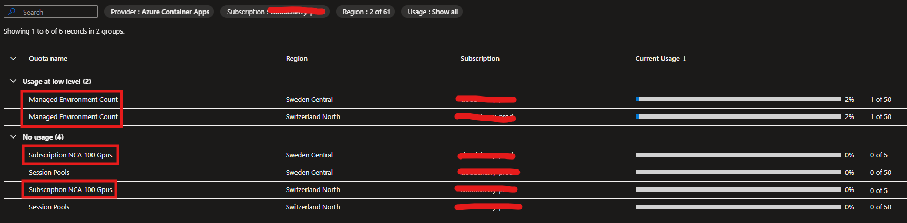

# How to Run APERTUS - The Swiss LLM Model - on Azure Container Apps

> [!NOTE]
> **COMING SOON**

This quickstart provides the following support:

* Infrastructure as Code to deploy the model on ACA with Serverless GPU and including all the required Azure Services like container registry, Azure Storage Account and Azure Keyvault.
* Customized ChainLit container ready to inference the model.
* Provision suitable _Spot instances_ in your Azure Subscription.

Find other deployment options [here](../README.md)

## Architecture

TODO

## Getting Started

Serverless GPUs accelerate AI development by allowing you to focus on your core AI code and less on managing infrastructure when using GPUs. This feature provides a middle layer option between the Apertus model and the managed compute.

The Container Apps serverless GPU support provides full data governance as your data never leaves the boundaries of your container while still providing a managed, serverless platform from which to build your applications.

When you use serverless GPUs in Container Apps, your apps get:

- Scale-to zero GPUs: Support for automatic serverless scaling of NVIDIA A100 and NVIDIA T4 GPUs.
- Per-second billing: Pay only for the GPU compute you use.
- Built-in data governance: Your data never leaves the container boundary.
- Flexible compute options: You can choose between the NVIDIA A100 or T4 GPU types.
- Middle-layer for AI development: Bring your own model on a managed, serverless compute platform.

This architecture represent the best option in terms of performance and cost management.

Serverless GPUs (A100 and T4) are only available on a subset of Azure Regions (including Switzerland North)

Please check the availability on the [**Product Availability by Region**](https://azure.microsoft.com/en-us/explore/global-infrastructure/products-by-region/table) page.

### Setup your environment

#### Environment Variables

- `LABEL` is a name that will be re-used for various Azure resources, such as resource groups and Azure Services.
- `LOCATION` is the Azure region to which your resources will be deployed. Be sure that you choose an Azure region where the SKU is available and you have quota for it.

in this example we used **Switzerland North** Datacenter.

```bash
export LABEL=swiss-llm-001
export LOCATION=switzerlandnorth
```

#### Check Container Apps Environmanet and Serverless GPU Quotas

Azure Container Apps implements different categories of quotas that govern resource allocation across different aspects of your apps. These quotas are organized into basic quotas that control fundamental resource limits, GPU quotas for applications requiring specialized compute capabilities, and dynamic sessions quotas for session-based workloads.

You can view your quota levels via the [Azure portal](https://ms.portal.azure.com/#view/Microsoft_Azure_Capacity/QuotaMenuBlade/~/myQuotas)

When in the portal, select **Azure Container Apps** for the *Provider*, Subscription and the Regions you are interested in.



If you need to request quota you can use the following:

| Quota | Scope | Request | View | Remarks |
|---|---|---|---|---|
| Managed Environment Count | Region | [Integrated request](quota-requests.md#integrated-requests) | [Portal](#list-usage-portal) | The number of environments per region. |
| Subscription NCA 100 GPUs | Region | [Integrated request](quota-requests.md#integrated-requests) | [Portal](#list-usage-portal) | The number of maximum dedicated A100 GPU cores environments across this region are allocated to use. |

for additional information: [Quotas for Azure Container Apps](https://learn.microsoft.com/en-us/azure/container-apps/quotas)

For this quickstart you need at least one managed environment and one Subscription NCA 100 GPUs available.

#### Clone the repository

```bash
git clone https://github.com/Azure-Samples/swiss-llm-quickstart
cd swiss-llm-quickstart/azure-container-apps
```

#### Deploy the Infrastructure

Quick deploy:

```bash
azd env set HUGGING_FACE_HUB_TOKEN hf_your_token_here
azd up 
```

## Test the Model

## Clean Up

To clean up all the resources created by this sample just delete the resource group.

```bash
az group delete --name MyResourceGroup --no-wait
```
## Cost Estimation

Pricing varies per region and usage, so it isn't possible to predict exact costs for your usage.
However, you can try the [Azure pricing calculator](https://azure.com/e/e3490de2372a4f9b909b0d032560e41b) for the resources below.

- [Azure Virtual Machine](https://azure.microsoft.com/en-us/pricing/details/virtual-machines/linux/)

⚠️ To avoid unnecessary costs, remember to take down your resources if it's no longer in use.

## References

- [Swiss-ai/Apertus-8B-Instruct-2509 · Hugging Face](https://huggingface.co/swiss-ai/Apertus-8B-Instruct-2509)
