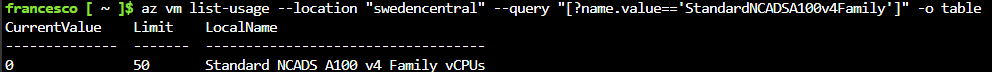
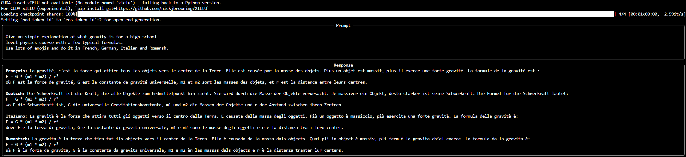

# How to Run APERTUS - The Swiss LLM Model - on Azure Virtual Machine

This quickstart provides the following support:

* Instructions on how to download the model from HuggingFace.
* Provision suitable _Spot instances_ in your Azure Subscription.
* Guidance on how to deploy and serve the model for **local inference**. 

Find other deployment options [here](../README.md)

## Demo


## Getting Started

For the **APERTUS 8B**, we will use the `Standard_NC24ads_A100_v4` SKU in Azure.

| Component | Specification |
|---|---|
| Series | NC_A100_v4 |
| vCPUs | 24 |
| CPU | AMD EPYC 7V13 (Milan) [x86-64] |
| System memory (RAM) | 220 GiB |
| GPUs | 1 × NVIDIA A100 PCIe |
| GPU memory | 80 GB |
| Local temporary disk | 64 GiB (per-size; series range: 64–256 GiB) |
| NVMe local storage | Up to 960 GiB (series) |
| Network bandwidth | Nominal: ~20,000 Mbps (20 Gbps); series supports up to 80,000 Mbps (80 Gbps) |
| NICs | 2 (series range: 2–8) |


For the **APERTUS 70B**, we will use the `Standard_NC48ads_A100_v4` SKU in Azure.

| Component | Specification |
|---|---|
| Series | NC_A100_v4 |
| vCPUs | 48 |
| CPU | AMD EPYC 7V13 (Milan) [x86-64] |
| System memory (RAM) | 440 GiB |
| GPUs | 2 × NVIDIA A100 PCIe |
| GPU memory | 2 x 80 GB |
| Local temporary disk | 64 GiB (per-size; series range: 64–256 GiB) |
| NVMe local storage | Up to 1920 GiB (series) |
| Network bandwidth | Nominal: ~20,000 Mbps (20 Gbps); series supports up to 80,000 Mbps (80 Gbps) |
| NICs | 2 (series range: 2–8) |

These SKUs are available only on a subset of Azure Regions. 

Please check the availability on the [**Product Availability by Region**](https://azure.microsoft.com/en-us/explore/global-infrastructure/products-by-region/table) page.

### Prerequisites

Before you begin:

- Azure CLI installed and logged in: `az login`
- Set your subscription: `az account set --subscription <SUBSCRIPTION_ID>`
- Sufficient quota for the selected GPU SKUs in your region
- A Hugging Face account and token (for model download)
- SSH key available (the deploy script can generate one if missing)

### Set up your environment

#### Environment Variables

Add the following environment variables:

- `LABEL` is a name that will be re-used for various Azure resources, such as resource groups and virtual machines.
- `LOCATION` is the Azure region to which your resources will be deployed. Be sure that you choose an Azure region where the SKU is available and you have quota for it.

in this example we used **Switzerland North** Datacenter.

```bash
export LABEL=swiss-llm-001
export LOCATION=switzerlandnorth
```
#### Check GPU quota for the VM

Based on the location you choose, you can check the current quota with the following:

```bash
az vm list-usage --location "${LOCATION}" --query "[?name.value=='StandardNCADSA100v4Family']" -o table
```



Check that the `Limit` value is at least **24** for `Standard_NC24ads_A100_v4` for APERTUS 8B and at least **48** for APERTUS 70B

#### Clone the repository

```bash
git clone https://github.com/Azure-Samples/swiss-llm-quickstart
cd swiss-llm-quickstart/azure-virtual-machine
```

#### Deploy the Virtual Machine in Azure

Based on the model you would like to install, you can run **one** of the following scripts

for [Apertus-8B-Instruct-2509](https://huggingface.co/swiss-ai/Apertus-8B-Instruct-2509)

```bash
./deploy.sh
```

for [Apertus-70B-Instruct-2509](https://huggingface.co/swiss-ai/Apertus-70B-Instruct-2509)

```bash
./deploy.sh --sku Standard_NC48ads_A100_v4
```

If you want to deploy a VM for [Apertus-70B-Instruct-2509](https://huggingface.co/swiss-ai/Apertus-70B-Instruct-2509) in a different region and with a different name, you can run:

```bash
./deploy.sh --location swedencentral --name vm-swiss-llm-002 --sku Standard_NC48ads_A100_v4
```

## Virtual Machine Installation

You should now be able to access the virtual machine with the SSH command 
displayed after executing the deploy script:

```bash
ssh azureuser@__public_ip_address__
```
When connected, you need to install the correct NVIDIA Drivers.

Ubuntu packages NVIDIA proprietary drivers. Those drivers come directly from NVIDIA and are simply packaged by Ubuntu so that they can be automatically managed by the system.

The following `init.sh` script, executed through cloud-init after VM creation, will:

1) Install ubuntu-drivers utility
2) Install the latest NVIDIA drivers
3) Download and install the CUDA toolkit from NVIDIA
4) Update PATH
5) Reboot the VM

> Note: The script may take a few minutes to complete.

After the VM has rebooted, verify the driver and toolkit installation:

```bash
nvidia-smi
nvcc --version || echo "nvcc not found; ensure CUDA toolkit installed"
```

### Prepare the Python Environment

Log in again into the VM and execute the following commands to install `uv` and prepare a Python environment:

```bash
curl -LsSf https://astral.sh/uv/install.sh | sh
source ~/.bashrc
uv init
```

Install `PyTorch`:

```bash
cat >> pyproject.toml <<'EOF'
[[tool.uv.index]]
name = "pytorch-cu128"
url = "https://download.pytorch.org/whl/cu128"
explicit = true

[tool.uv.sources]
torch = [
  { index = "pytorch-cu128", marker = "sys_platform == 'linux' or sys_platform == 'win32'" },
]
torchvision = [
  { index = "pytorch-cu128", marker = "sys_platform == 'linux' or sys_platform == 'win32'" },
]
EOF
uv add torch torchvision
uv add vllm
uv add transformers
uv add git+https://github.com/nickjbrowning/XIELU
uv add "huggingface_hub[cli]"
uv add rich
uv add flashinfer-python
uv add huggingface_hub hf_transfer
uv add fastsafetensors
```

Log in to Hugging Face Hub and install the model.

for [Apertus-8B-Instruct-2509](https://huggingface.co/swiss-ai/Apertus-8B-Instruct-2509)

```bash
uv run hf auth login
uv run hf download swiss-ai/Apertus-8B-Instruct-2509
```

for [Apertus-70B-Instruct-2509](https://huggingface.co/swiss-ai/Apertus-70B-Instruct-2509)

```bash
uv run hf auth login
uv run hf download swiss-ai/Apertus-70B-Instruct-2509
```

## Run the model using vLLM

We will use [vLLM](https://docs.vllm.ai/en/v0.7.3/index.html) to run the model.


for [Apertus-8B-Instruct-2509](https://huggingface.co/swiss-ai/Apertus-8B-Instruct-2509)

```bash
uv run vllm serve swiss-ai/Apertus-8B-Instruct-2509 \
  --load-format fastsafetensors \
  --gpu-memory-utilization 0.95 \
  --max-model-len 4096 \
  --max-num-seqs 512 \
  --dtype auto \
  --safetensors-load-strategy eager \
  --enforce-eager
```

for [Apertus-70B-Instruct-2509](https://huggingface.co/swiss-ai/Apertus-70B-Instruct-2509)

```bash
uv run vllm serve swiss-ai/Apertus-70B-Instruct-2509 \
  --tensor-parallel-size 2 \
  --max-num-seqs 32 \
  --gpu-memory-utilization 0.98 \
  --dtype auto \
  --safetensors-load-strategy eager \
  --enforce-eager \
  --host 127.0.0.1
```

## Test the Model

To test the model, open an additional SSH terminal on the VM (keep the first one running the server) and run the following command. If you prefer to call from your local machine, you can use SSH port forwarding: `ssh -L 8000:localhost:8000 azureuser@<ip>`

for [Apertus-8B-Instruct-2509](https://huggingface.co/swiss-ai/Apertus-8B-Instruct-2509)

```bash
curl http://localhost:8000/v1/chat/completions \
-H "Content-Type: application/json" \
-d '{
    "model": "swiss-ai/Apertus-8B-Instruct-2509",
    "messages": [
        {"role": "system", "content": "You are a helpful assistant."},
        {"role": "user", "content": "Give a simple explanation of what gravity is for a high school level physics course with a few typical formulas. Use lots of emojis and do it in French, Swiss German, Italian and Romansh."}
    ]
}'
```

for [Apertus-70B-Instruct-2509](https://huggingface.co/swiss-ai/Apertus-70B-Instruct-2509)

```bash
curl http://localhost:8000/v1/chat/completions \
-H "Content-Type: application/json" \
-d '{
    "model": "swiss-ai/Apertus-70B-Instruct-2509",
    "messages": [
        {"role": "system", "content": "You are a helpful assistant."},
        {"role": "user", "content": "Give a simple explanation of what gravity is for a high school level physics course with a few typical formulas. Use lots of emojis and do it in French, Swiss German, Italian and Romansh."}
    ]
}'
```

If the installation completes successfully, you should see something similar to this:



## Clean Up

To clean up all the resources created by this sample, delete the resource group used during deployment.

```bash
az group delete --name "rg-${LABEL}" --yes --no-wait
```

Or if you want to clean up the virtual machine and attached resources only, you can run:

```bash
RESOURCE_GROUP="rg-${LABEL}"
VM_NAME="vm-swiss-llm-001"

az resource update \
  --resource-group "${RESOURCE_GROUP}" \
  --name "${VM_NAME}" \
  --resource-type virtualMachines \
  --namespace Microsoft.Compute \
  --set properties.storageProfile.osDisk.deleteOption=delete
  
az vm delete \
  --resource-group "${RESOURCE_GROUP}" \
  --name "${VM_NAME}" \
  --force-deletion
```

## Cost Estimation

Pricing varies per region and usage, so it isn't possible to predict exact costs for your usage.
However, you can try the [Azure pricing calculator](https://azure.com/e/e3490de2372a4f9b909b0d032560e41b) for the resources below.

- [Azure Virtual Machine](https://azure.microsoft.com/en-us/pricing/details/virtual-machines/linux/)

⚠️ To avoid unnecessary costs, remember to take down your resources if it's no longer in use.

You can reduce VM cost by deallocating the VM when not in use. This will stop the VM and you will not be charged for compute resources, but you will still be charged for storage.

```bash
az vm deallocate -g MyResourceGroup -n MyVmName
```

## References

- [Azure N-series GPU driver setup for Linux - Azure Virtual Machines | Microsoft Learn](https://learn.microsoft.com/en-us/azure/virtual-machines/linux/n-series-driver-setup#ubuntu)
- [vLLM](https://docs.vllm.ai/en/v0.7.3/index.html)
- [Swiss-ai/Apertus-8B-Instruct-2509 · Hugging Face](https://huggingface.co/swiss-ai/Apertus-8B-Instruct-2509)
- [Swiss-ai/Apertus-70B-Instruct-2509 · Hugging Face](https://huggingface.co/swiss-ai/Apertus-70B-Instruct-2509)
- [PyTorch Get Started](https://pytorch.org/get-started/locally/)

## Notes

- Spot instances: The deploy scripts use Spot priority by default (`--priority Spot`). Spot VMs are lower-cost but can be evicted. For uninterrupted runs, switch to regular priority by removing that flag or setting `--priority Regular`.
- Server lifetime: Consider running `vllm serve` inside `tmux` or `screen` to avoid interruption when the SSH session closes.
